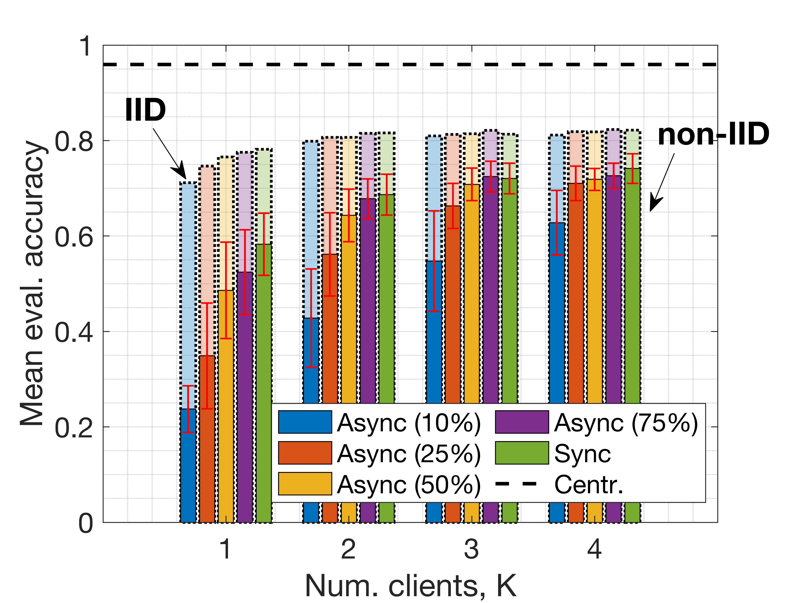

# blockchain_enabled_federated_learning
Simulation-based performance analysis of server-less Blockchain-enabled Federated Learning

# Blockchain-enabled Server-less Federated Learning #

## Table of Contents
- [Authors](#authors)
- [Publication's abstract](#abstract)
- [Repository description](#repository-description)
- [Usage](#usage)
- [Performance Evaluation](#performance-evaluation)
- [References](#references)
- [Contribute](#contribute)

## Authors
* [Francesc Wilhelmi](https://fwilhelmi.github.io/)
* [Lorenza Giupponi](http://www.cttc.es/people/lgiupponi/)
* [Paolo Dini](http://www.cttc.es/people/pdini/)

## Abstract
Motivated by the heterogeneous nature of devices participating in large-scale Federated Learning (FL) optimization, we focus on an asynchronous server-less FL solution empowered by Blockchain (BC) technology. In contrast to mostly adopted FL approaches, which assume synchronous operation, we advocate an asynchronous method whereby model aggregation is done as clients submit their local updates. The asynchronous setting fits well with the federated optimization idea in practical large-scale settings with heterogeneous clients. Thus, it potentially leads to higher efficiency in terms of communication overhead and idle periods. To evaluate the learning completion delay of BC-enabled FL, we provide an analytical model based on batch service queue theory. Furthermore, we provide simulation results to assess the performance of both synchronous and asynchronous mechanisms. Important aspects involved in the BC-enabled FL optimization, such as the network size, link capacity, or user requirements, are put together and analyzed. As our results show, the synchronous setting leads to higher prediction accuracy than the asynchronous case. Nevertheless, asynchronous federated optimization provides much lower latency in many cases, thus becoming an appealing FL solution when dealing with large data sets, tough timing constraints (e.g., near-real-time applications), or highly varying training data.

## Repository description
This repository contains the resources used to generate the results included in the paper entitled "Blockchain-enabled Server-less Federated Learning". The files included in this repository are:

1. LaTeX files: contains the files used to generate the manuscript.
2. Code & Results: scripts and code used to generate the results included in the paper.

- Queue code: scripts used to execute the Blockchain queuing delay simulations through the [batch-service queue simulator](https://github.com/fwilhelmi/batch_service_queue_simulator).
- TensorFlow code: python scripts used to execute the FL mechanisms through [TensorFlowFederated](https://www.tensorflow.org/federated).
- Matlab code: matlab scripts used to process the results and plot the figures included in the manuscript.
- Outputs: files containing the outputs from the different resources (queue simulator, TFF).
- Figures: figures included in the manuscript and others with preliminary results.

## Usage

### Part 1: Batch service queue analysis

To generate the results related to the analysis of the queueing delay in the Blockchain, we used our [batch-service queue simulator](https://github.com/fwilhelmi/batch_service_queue_simulator) (commit: f846b66). Please, refer to that repository's documentation for installation/execution guidelines. As for the corresponding theoretical background, more details can be found in [1].

The obtained results from this part can be found at "Matlab code/output_queue_simulator". To reproduce them, execute the scripts from the "Batch service queue" folder in the batch-service queue simulator.

### Part 2: FLchain analysis

[Tensorflow Federated (TFF)](https://www.tensorflow.org/federated) has been used to evaluate the proposed s-FLchain and a-FLchain mechanisms in the manuscript. To get started with TF (and TFF), we strongly recommend using the tutorials in [https://www.tensorflow.org/federated/tutorials/tutorials_overview](https://www.tensorflow.org/federated/tutorials/tutorials_overview).

Once the TFF environment has been setup, our results can be reproduced by using the scripts in "TensorFlow code":
1. centalized_baseline.py: centralized ML model for getting baseline results (upper/lower bounds).
2. sFLchain_vs_aFLchain.py: script generating the output for the comparison of the synchronous and the asynchronous models. 

The output results from this part can be found at "Matlab code/output_tensorflow".

### Part 3: End-to-end analysis framework

Finally, to gather all the resources together, we have used the end-to-end latency framework contained in this repository ("Matlab code/simulation_scripts"). Those files contain the communication and computation models used to calculate the total latency experienced by each considered Blockchain-enabled FL mechanism. Moreover, to get the end-to-end latency and accuracy results, the abovementioned scripts gather and process the outputs obtained from both batch-service queue simulator and TFF.

Content:
1. 0_preliminary_results: evaluation of several FL parameters via TFF (out of the scope of this publication).
2. 1_blockchain_analysis: evaluation of the Blockchain queuing delay (refer to Part 1: Batch service queue analysis). 
3. 2_flchain: evaluation of the FL accuracy (refer to Part 2: FLchain analysis) and end-to-end latency analysis. Includes models to compute communication and computation-related delays.

## Performance Evaluation

### Simulation parameters

The simulation parameters used in the publication are as follows:

|         | **Parameter**                         | **Value**            |
|---------|---------------------------------------|----------------------|
|         | Number of miners                      | 19          	     |
|         | Transaction size                      | 5 kbits              |
| **BC**  | Block header size                     | 20 kbits             |
|         | Max. waiting time                     | 1000 seconds         |
|         | Queue length                          | 1000 packets         |
|---------|---------------------------------------|----------------------|
|         | Min/max distance Client-BS            | 0/4.15 meters        |
|         | Bandwidth.                            | 180 kHz              |
|         | Min/max distance Client-BS            | 2 GHz                |
|         | Min/max distance Client-BS            | 0 dBi                |
|**Comm.**| Loss at the reference distance (P_L0) | 5 dB                 |
|         | Path-loss exponent (α)                | 4.4                  |
|         | Shadowing factor (σ)                  | 9.5                  |
|         | Obstacles factor (γ)                  | 30                   |   
|         | Ground noise                          | -95 dBm              |    
|         | Capacity P2P links                    | 5 Mbps               | 
|---------|---------------------------------------|----------------------|
|         | Learning algorithm                    | Neural Network       |
|         | Number of hidden layers               | 2                    |
|         | Activation function                   | ReLU                 |
|         | Optimizer                             | SGD                  |
|         | Loss function                         | Cat. cross-entropy   |
| **ML**  | Learning rate (local/global)          | 0.01/1               |
|         | Epochs number                         | 5                    |
|         | Batch size                            | 20                   |
|         | CPU cycles to process a data point    | 10^-5                |
|         | Clients' clock speed                  | 1 GHz                |

### Simulation Results

In what follows, we present the results presented in the manuscript. First, we refer to the Blockchain queuing delay analysis, where we assess the sensitivity of the Blockchain on various parameters, including the block size, the mining rate, the traffic intensity, or the miners' communication capacity.

Next, we provide a broader vision of the Blockchain transaction confirmation latency by including other delays different than the queuing delay, such as transaction upload, block generation, or block propagation.

Finally, we present the results obtained for the evaluation of s-FLchain and a-FLchain in terms of learning accuracy and learning completion time:

## References

[1] Wilhelmi, F., & Giupponi, L. (2021). Discrete-Time Analysis of Wireless Blockchain Networks. arXiv preprint arXiv:2104.05586.

## Contribute

If you want to contribute, please contact to [fwilhelmi@cttc.cat](fwilhelmi@cttc.cat).

